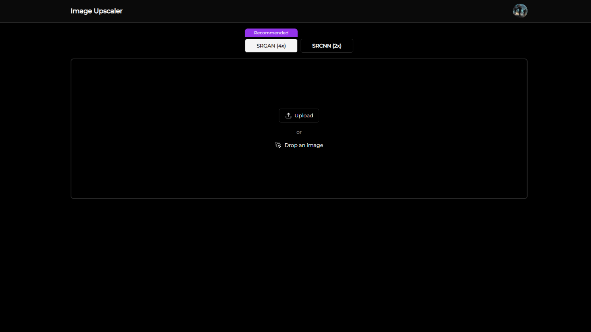
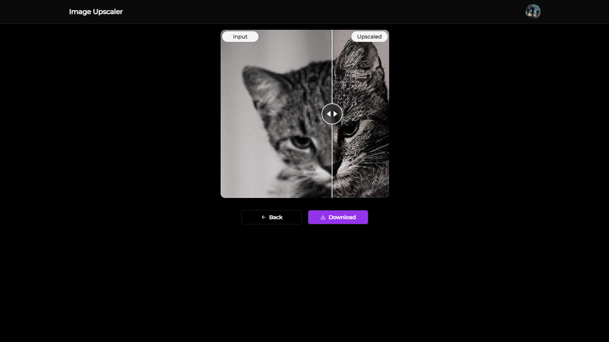

# Image Upscaler
#### Image Upscaler is a web app that uses SRCNN and SRGAN models to increase the resolution of your low resolution images without losing quality.  

This repository contains the frontend for Image Upscaler created using NextJS.

#### 🔗 [Backend Github repository](https://github.com/vedantyadu/imageupscaler-model-backend)  
## Screenshots
#### Upload view

#### Upscale view
  

## Getting started
### Installing dependencies
```bash
npm install
```
### Environment variables
Create a `.env` file and put the following variables inside the file :
- `DATABASE_URL`
- `GOOGLE_OAUTH_CLIENT_SECRET`
- `GOOGLE_OAUTH_TOKEN_URI`
- `JWT_ACCESS_PRIVATE_KEY`
- `JWT_REFRESH_PRIVATE_KEY`
- `NEXT_SERVER_URL`
- `UPSCALE_BACKEND_URL`

### Prisma migrations
```bash
prisma migrate dev/deploy
```
### Start the development server
```bash
npm run dev
```